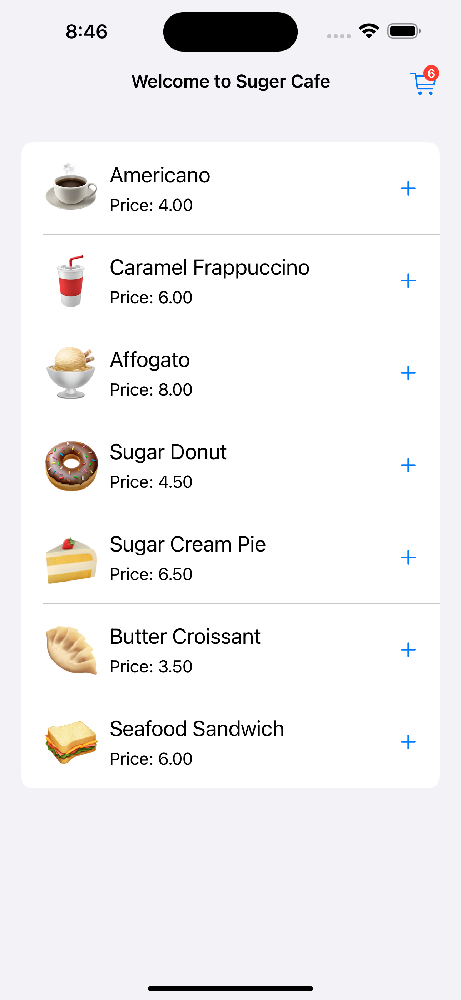
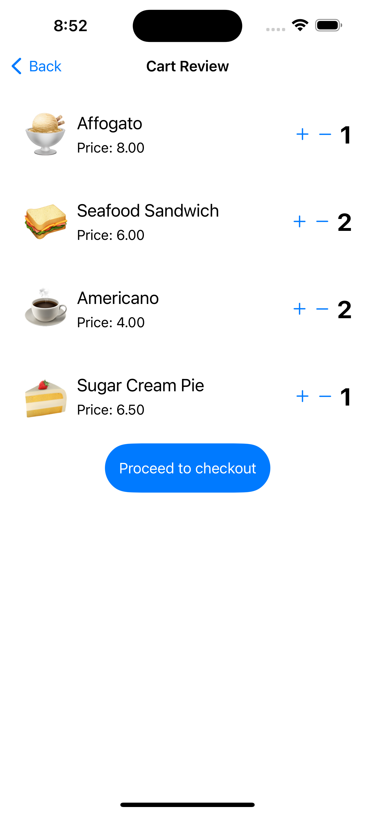
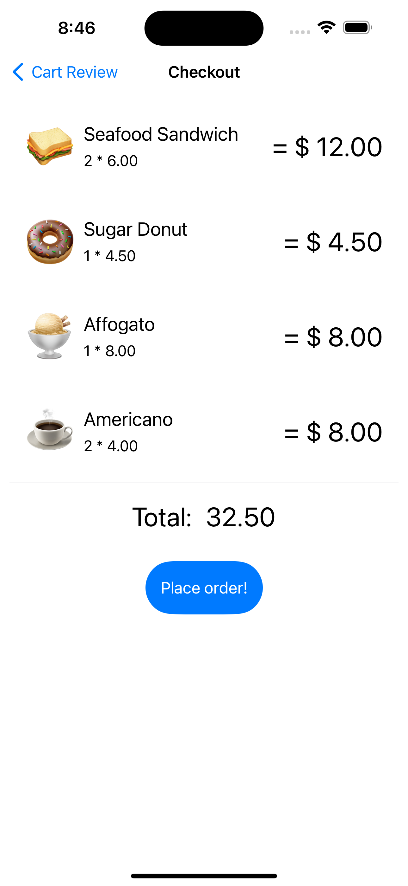
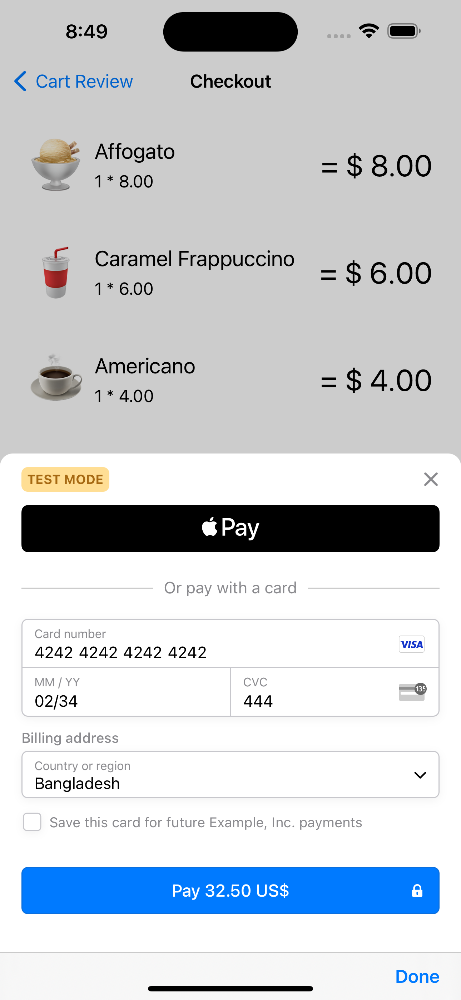
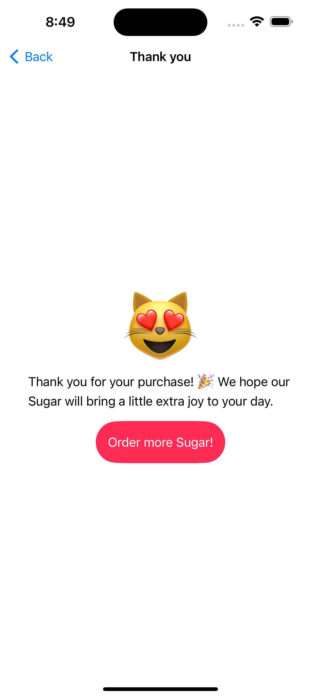

## Complete iOS E-Commerce Shopping App in SwiftUI with Stripe & Apple Pay Integration
### This is a demo project for showing the essential steps of developing a Shopping App using SwiftUI. 

We have implemented Payment Gateway using Stripe. Also implemented Apple Pay for using Apple Wallet. You can get the tutorial of this project from [JakirHossain.com](https://jakirhossain.com/complete-e-commerce-app-in-swiftui-with-stripe-apple-pay/)

**Screenshots:**

